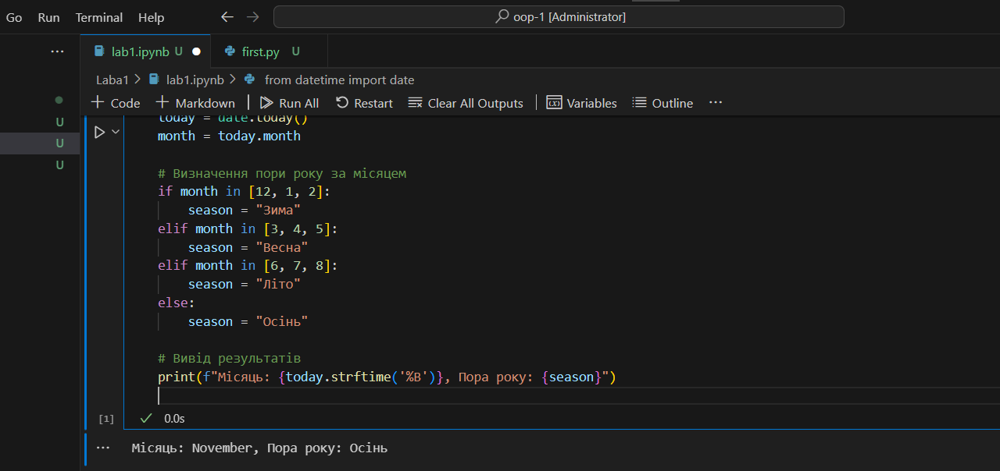

# Звіт до першої лабораторної
## Тема: перша програма на мові *Python*

### Виконання роботи
- Результати виконання завдання:
    1. Виконали першу програму, результат виконання: ;
    1. Модифікували програму та використали [Python Notebook для її виконання](nb.ipynb);
    
    
    
    1. Програма вивела значення
    1. Отримано наступні результати Місяць: November, Пора року: Осінь
    1. Навчились прості програми на мові Python


+ 1.Скрін першої програми [фото](img1.png)
+ 2.Скрін другої програми [фото](img2.png)


___


```Python
from datetime import date

# Отримати поточну дату
today = date.today()
month = today.month

# Визначення пори року за місяцем
if month in [12, 1, 2]:
    season = "Зима"
elif month in [3, 4, 5]:
    season = "Весна"
elif month in [6, 7, 8]:
    season = "Літо"
else:
    season = "Осінь"

# Вивід результатів
print(f"Місяць: {today.strftime('%B')}, Пора року: {season}")

```
